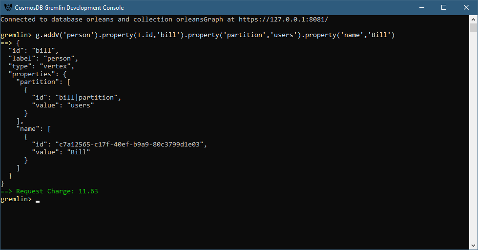

Just a simple .net console app for executing Gremlin queries. Displays the raw GraphSON for now.



## Getting Started

Add a simple vertex to the graph.
```
g.addV('user').property('name', 'Bob')
```
This query creates a vertex with the label 'user'. The vertex has a single property called 'name' with a value of 'Bob'.

Every vertex also has an identifier called 'id'. If the 'id' is not specified, Cosmos DB will auto generate a GUID for the 'id' property.

```
{
  "id": "c95e7556-b65d-4763-b993-a6418fd52863",
  "label": "user",
  "type": "vertex",
  "properties": {
    "name": [
      {
        "id": "8b7cd0a3-8271-45c0-b556-105b85153d73",
        "value": "Bob"
      }
    ]
  }
}
```

